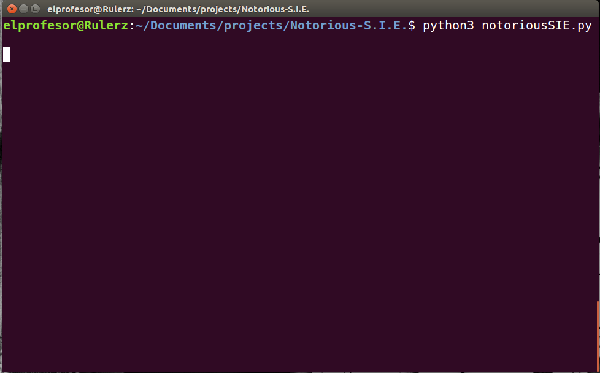
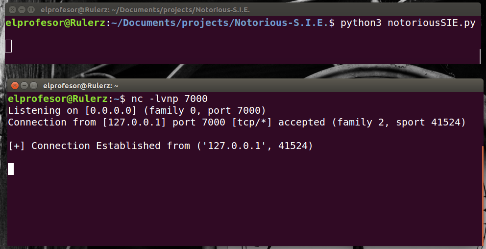
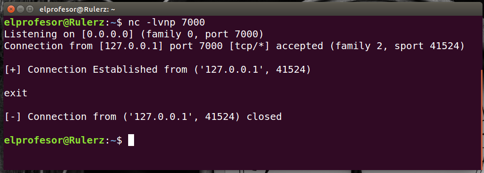

# Notorious-S.I.E.

A simple python reverse shell that connects automatically to the server.

# Logic behind it

- Change the config file with any port that you want(exemple: 7000)
- Run the shell. The shell will stay basically in background.
- Shell will try to connect to server every 2 seconds.
- You can detect it if you look closely to current running processes.

- Run the server(another python server script or with linux command nc).
- The shell will connect to server instantly.
- If you type 'exit' the server will close the connection and itself.
- If you try to run server again. BAAAAM
- A new connection from shell to server will be established.


# Usage: 

- Change 'config.py' with ip and port that you want.
- To weaponize the shell: ```python3 notoriousSIE.py```
- To run the server: ```nc -lvnp 7000```
- To close connection: type simply 'exit'

# Notes:

- If you fire up the server, the shell will connect immediately.
- If you close the connection in a safe way(typing exit) the shell will stay alive.
- So any time you want to run the server, the shell will give you a brand new connection.

- This is for educational purpose only.
- DO NOT use this in any different way than basically studying the roots of connections out of it.

# Some POC:

- Run shell



- Run server



- Exit connection



# TODO:

- attach a keylogger
- attach process handler to detect some apps.
- doing a shell script to convert it in an executable.
- convert this to any other operating systems rather than linux.
